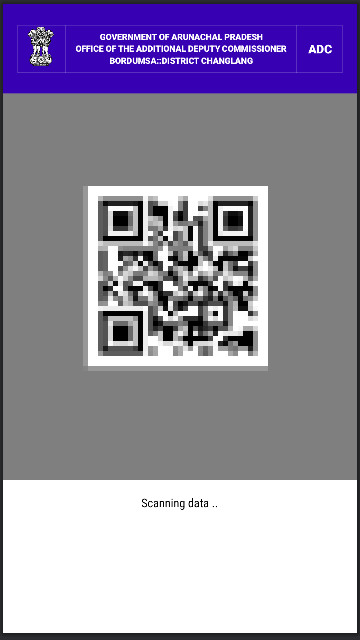
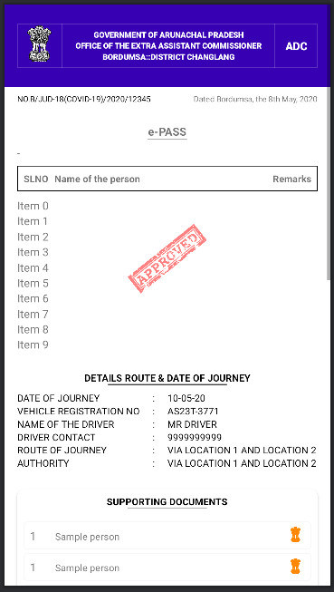
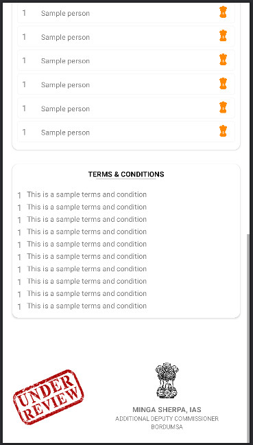

# 🛡️ ePassChecker - COVID-19 Travel Pass Verification App

<div align="center">


**A secure QR code scanner application for verifying COVID-19 travel passes issued by the Government of Arunachal Pradesh**

[](https://opensource.org/licenses/MIT)
[](https://android-arsenal.com/api?level=21)

</div>

---

## 📋 Table of Contents

- [🎯 Overview](#-overview)
- [✨ Features](#-features)
- [🏗️ Architecture](#️-architecture)
- [📱 Screenshots](#-screenshots)
- [🛠️ Technical Stack](#️-technical-stack)
- [📦 Installation](#-installation)
- [🚀 Usage](#-usage)
- [🔧 Configuration](#-configuration)
- [📁 Project Structure](#-project-structure)
- [🤝 Contributing](#-contributing)
- [📄 License](#-license)
- [👨‍💻 Author](#-author)

---

## 🎯 Overview

**ePassChecker** is a specialized Android application developed during the COVID-19 pandemic (2020) as part of the ePass Project ecosystem. This app serves as a verification tool for security personnel at check gates to authenticate and validate travel passes generated by the companion **ePassBordumsa** application.

### 🎯 Purpose
- **Primary Use**: Verify QR code-based travel passes at security checkpoints
- **Target Users**: Security personnel, law enforcement, and checkpoint officials
- **Geographic Scope**: Government of Arunachal Pradesh, District Changlang, Bordumsa
- **Emergency Response**: COVID-19 pandemic travel restriction management

---

## ✨ Features

### 🔍 **QR Code Scanning**
- **Real-time QR Code Detection**: Advanced camera-based scanning using Google Vision API
- **Instant Verification**: Immediate validation of travel pass authenticity
- **High Accuracy**: Optimized for various lighting conditions and QR code sizes
- **Gesture Controls**: Tap to capture, pinch/zoom for better scanning

### 📄 **Travel Pass Display**
- **Comprehensive Details**: Complete travel pass information display
- **Official Formatting**: Government-standard document layout
- **Status Indicators**: Clear approval/expired status visualization
- **Authority Information**: Official signatures and designations

### 🛡️ **Security Features**
- **Authentication Verification**: Server-side validation of pass authenticity
- **Expiry Checking**: Automatic validation of pass expiration
- **Tamper Detection**: Verification of pass integrity
- **Offline Capability**: Basic scanning without internet dependency

### 📱 **User Experience**
- **Intuitive Interface**: Simple, government-official friendly design
- **Fast Performance**: Optimized for quick checkpoint operations
- **Error Handling**: Clear feedback for invalid or expired passes
- **Accessibility**: Designed for various lighting conditions

---

## 🏗️ Architecture

### **Modular Design**
```
ePassChecker/
├── app/                    # Main application module
│   ├── MainActivity      # QR Scanner & Camera
│   ├── PermitDetailActivity # Pass Details Display
│   └── ImageViewerActivity # Document Viewer
├── core/                   # Shared business logic
│   ├── models/            # Data models (EPass, Traveller, etc.)
│   ├── api/               # Network layer
│   └── utilities/         # Helper classes
└── utility/               # Camera & Vision utilities
```

### **Key Components**
- **Camera Integration**: Custom camera source with Google Vision API
- **QR Processing**: Barcode detection and processing pipeline
- **Data Models**: Comprehensive pass data structure
- **Network Layer**: RESTful API integration with Retrofit
- **UI Components**: Material Design with government branding

---

## 📱 Screenshots

<div align="center">

### QR Code Scanner Interface

*Real-time QR code scanning with camera preview and detection overlay*

### Travel Pass Details

*Comprehensive pass details showing traveller information, route, and approval status*

### Terms & Conditions View

*Detailed terms and conditions with supporting documents*

</div>

---

## 🛠️ Technical Stack

### **Core Technologies**
- **Platform**: Android (API 21+)
- **Language**: Java 8
- **Build System**: Gradle 3.6.3
- **Architecture**: MVC with modular design

### **Key Libraries**
```gradle
// UI & Material Design
implementation 'com.google.android.material:material:1.1.0'
implementation 'androidx.appcompat:appcompat:1.1.0'

// Camera & Vision
implementation 'com.google.android.gms:play-services-vision:20.0.0'
implementation 'com.google.zxing:core:3.4.0'

// Network & Data
implementation 'com.squareup.retrofit2:converter-gson:2.8.1'
implementation 'com.squareup.okhttp3:logging-interceptor:4.7.0'
implementation 'com.squareup.picasso:picasso:2.71828'

// Utilities
implementation 'org.parceler:parceler-api:1.1.13'
implementation 'com.github.chrisbanes:PhotoView:2.3.0'
```

### **Permissions Required**
```xml
<uses-permission android:name="android.permission.CAMERA" />
<uses-permission android:name="android.permission.INTERNET" />
<uses-permission android:name="android.permission.WRITE_EXTERNAL_STORAGE" />
```

---

## 📦 Installation

### **Prerequisites**
- Android Studio 4.0+
- Android SDK API 21+
- Java 8+
- Google Play Services

### **Build Instructions**

1. **Clone the Repository**
   ```bash
   git clone https://github.com/yourusername/ePassChecker.git
   cd ePassChecker
   ```

2. **Open in Android Studio**
   ```bash
   # Open Android Studio
   # File -> Open -> Select ePassChecker folder
   ```

3. **Configure Dependencies**
   ```bash
   # Sync project with Gradle files
   # Install required SDK components if prompted
   ```

4. **Build & Run**
   ```bash
   # Build the project
   ./gradlew assembleDebug
   
   # Install on device
   ./gradlew installDebug
   ```

### **APK Generation**
```bash
# Generate signed APK
./gradlew assembleRelease
```

---

## 🚀 Usage

### **For Security Personnel**

1. **Launch the App**
   - Open ePassChecker on your Android device
   - Grant camera permissions when prompted

2. **Scan QR Code**
   - Point camera at the travel pass QR code
   - Wait for automatic detection
   - Tap to capture when QR code is highlighted

3. **Verify Pass Details**
   - Review all travel pass information
   - Check approval status and expiry
   - Verify traveller details and route

4. **Take Action**
   - Allow passage for valid passes
   - Deny access for invalid/expired passes
   - Contact authorities if needed

### **Best Practices**
- Ensure good lighting for QR scanning
- Keep device steady during scanning
- Verify all details before allowing passage
- Report suspicious or invalid passes

---

## 🔧 Configuration

### **API Configuration**
```java
// Update API endpoints in core module
public class ApiManager {
    private static final String BASE_URL = "https://your-api-endpoint.com/";
    // Configure your server endpoints
}
```

### **Government Branding**
```xml
<!-- Update in strings.xml -->
<string name="app_name">e-Pass Scanner</string>
<string name="authority_name">GOVERNMENT OF ARUNACHAL PRADESH</string>
<string name="office_name">OFFICE OF THE ADDITIONAL DEPUTY COMMISSIONER</string>
```

### **Camera Settings**
```java
// Optimize camera settings for your environment
CameraSource.Builder builder = new CameraSource.Builder(context, barcodeDetector)
    .setRequestedPreviewSize(1600, 1024)
    .setRequestedFps(15.0f);
```

---

## 📁 Project Structure

```
ePassChecker/
├── 📁 app/                          # Main Application
│   ├── 📁 src/main/java/com/jenbumapps/e_passchecker/
│   │   ├── 📄 MainActivity.java     # QR Scanner Activity
│   │   ├── 📄 PermitDetailActivity.java # Pass Details
│   │   ├── 📄 ImageViewerActivity.java  # Document Viewer
│   │   ├── 📁 adapter/              # RecyclerView Adapters
│   │   └── 📁 utility/              # Camera Utilities
│   ├── 📁 src/main/res/
│   │   ├── 📁 layout/              # UI Layouts
│   │   ├── 📁 drawable/            # Icons & Images
│   │   └── 📁 values/              # Strings & Colors
│   └── 📄 build.gradle             # App Dependencies
├── 📁 core/                        # Shared Module
│   ├── 📁 src/main/java/com/jenbumapps/core/
│   │   ├── 📁 model/               # Data Models
│   │   ├── 📁 api/                 # Network Layer
│   │   └── 📁 utilities/           # Helper Classes
│   └── 📄 build.gradle             # Core Dependencies
├── 📄 build.gradle                 # Project Configuration
├── 📄 settings.gradle              # Module Settings
└── 📄 README.md                    # This File
```

---

## 🤝 Contributing

We welcome contributions to improve ePassChecker! Here's how you can help:

### **Development Setup**
1. Fork the repository
2. Create a feature branch: `git checkout -b feature/amazing-feature`
3. Commit your changes: `git commit -m 'Add amazing feature'`
4. Push to the branch: `git push origin feature/amazing-feature`
5. Open a Pull Request

### **Contribution Guidelines**
- Follow Android coding standards
- Write clear commit messages
- Test on multiple devices
- Update documentation as needed
- Respect government security requirements

### **Areas for Contribution**
- 🐛 Bug fixes and improvements
- 📱 UI/UX enhancements
- 🔒 Security improvements
- 📚 Documentation updates
- 🧪 Testing and quality assurance

---

## 📄 License

This project is licensed under the MIT License - see the [LICENSE](LICENSE) file for details.

```
MIT License

Copyright (c) 2020 ePass Project - Government of Arunachal Pradesh

Permission is hereby granted, free of charge, to any person obtaining a copy
of this software and associated documentation files (the "Software"), to deal
in the Software without restriction, including without limitation the rights
to use, copy, modify, merge, publish, distribute, sublicense, and/or sell
copies of the Software, and to permit persons to whom the Software is
furnished to do so, subject to the following conditions:

The above copyright notice and this permission notice shall be included in all
copies or substantial portions of the Software.
```

---

## 👨‍💻 Author

**Jenbum Apps** - *ePass Project Development Team*

- **Project**: ePassChecker - COVID-19 Travel Pass Verification
- **Organization**: Government of Arunachal Pradesh
- **Location**: Bordumsa, District Changlang
- **Year**: 2020 (COVID-19 Emergency Response)

### **Acknowledgments**
- Government of Arunachal Pradesh
- District Administration, Changlang
- COVID-19 Emergency Response Team
- Security Personnel and Checkpoint Officials

---

<div align="center">

### 🏛️ **Government of Arunachal Pradesh**
**Office of the Additional Deputy Commissioner**  
**Bordumsa, District Changlang**

---

**Developed during COVID-19 pandemic for public safety and travel management**

[](https://github.com/yourusername)

</div>
